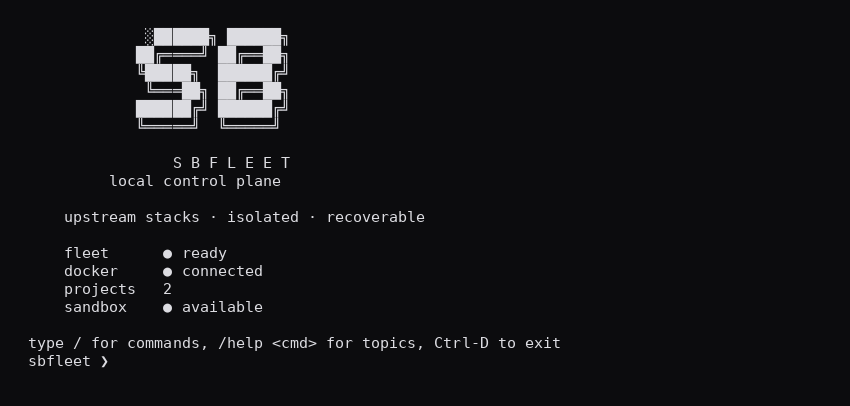
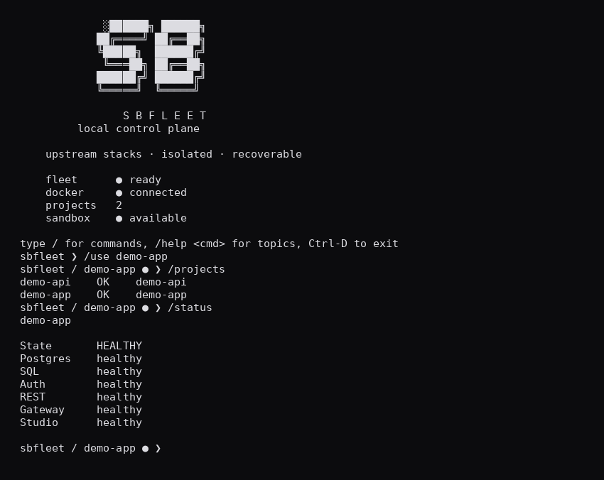
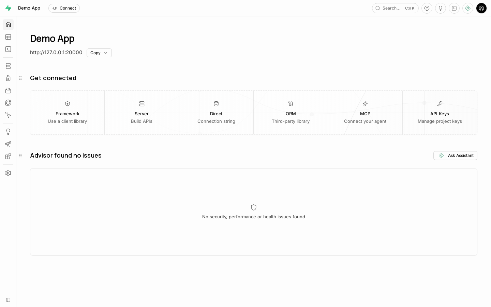
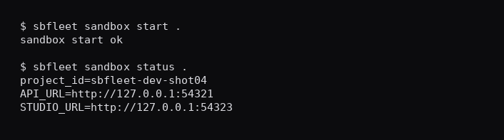

# SBfleet

**Local control plane for self-hosted Supabase stacks**

`upstream stacks · isolated · recoverable`

[](https://www.python.org/downloads/)
[](LICENSE)

SBfleet is a small Python CLI that manages **independent official self-hosted Supabase stacks** on one Linux host. It is not a Supabase fork and not a generic container orchestrator. Original Studio stays the GUI; official upstream images and tooling stay authoritative.

SBfleet is an independent open-source project and is **not affiliated with, sponsored by, or endorsed by Supabase**. Third-party names and marks belong to their respective owners.

---

## What is SBfleet?

Running more than one self-hosted Supabase project on a single machine is awkward: port collisions, shared Compose projects, ad-hoc scripts, and fragile recovery. SBfleet turns that into an explicit local control plane:

- one **official** self-hosted stack per long-lived project
- a **filesystem registry** (no control-plane database)
- guarded lifecycle (create / start / stop / remove)
- **recovery-verified** cold backups and **same-pin** restore
- a **disposable** official-CLI sandbox for app repos, kept separate from fleet projects

If you want multiple local Supabase backends with clear safety boundaries—and you want to keep upstream Studio and upstream run/update scripts—SBfleet is the tool.

---

## Why SBfleet?

| Capability | What you get |
|---|---|
| Independent stacks | Each project owns its Compose project, ports, volumes, and secrets |
| Original Studio | Upstream Studio via the project gateway — SBfleet does not replace the UI |
| Filesystem registry | JSON metadata under the fleet home; no daemon, no central DB |
| Guarded lifecycle | Mutations require identity, ownership, and lock checks |
| Recovery-verified backup | Encrypted archives; verification is stronger than “file exists” |
| Same-pin restore | Restore into a matching upstream pin/architecture |
| Disposable sandbox | Pinned Supabase CLI sandboxes for app workspaces (no Cloud login/link) |
| Explicit local safety | Loopback publish, labeled ownership, diagnostic redaction |

---

## Screenshots










---

## Quick start

```bash
bash scripts/install-user.sh
# Ensure ~/.local/bin is on PATH (new login shell, or: export PATH="$HOME/.local/bin:$PATH")

sbfleet doctor
sbfleet create myapp --yes
sbfleet start myapp
sbfleet studio myapp --url-only
sbfleet status myapp
```

Interactive shell (TTY):

```bash
sbfleet
# /create myapp
# /status
# /studio
# /use --clear   # return to fleet root
```

---

## Installation / prerequisites

**Host**

- Linux (amd64 or arm64) with local Docker Engine **28+**, Compose v2 (`!override` support), and an ordinary Docker-authorized user
- Python **3.10+** (with `venv`), Git, jq, OpenSSL, Node **≥16**
- No root/sudo required for the SBfleet installer once Docker access exists

**Operator install (durable)**

```bash
bash scripts/install-user.sh
# Optional: bash scripts/install-user.sh --configure-path   # append ~/.local/bin to ~/.profile
```

This installs a non-editable package under `~/.local/lib/sbfleet/current/` (transactional staging promoted via the `current` symlink), places **only** `~/.local/bin/sbfleet` for PATH discovery, and provisions managed tools under that generation (invoked by absolute path; not published as `~/.local/bin/age` / `supabase`). Artifact SHA256 pins live in [`packaging/tool-pins.toml`](packaging/tool-pins.toml). Downloaded Supabase CLI and age binaries are third-party software under their own licenses — see [`THIRD_PARTY_NOTICES.md`](THIRD_PARTY_NOTICES.md).

**Verify**

```bash
# Current shell may need ~/.local/bin first:
export PATH="$HOME/.local/bin:$PATH"

env -i HOME="$HOME" USER="$USER" PATH="/usr/bin:/bin:$HOME/.local/bin" \
  /bin/sh -c 'command -v sbfleet && sbfleet --version && sbfleet doctor'
```

Installer reports **INSTALLATION ARTIFACTS READY** separately from **CURRENT SHELL** availability. **FULL V1 READY** requires artifact planes (**SBFLEET CLI**, **DOCKER**, **BACKUP**, **SANDBOX**) **and** the current shell being able to resolve `sbfleet`. If artifacts are ready but this shell’s PATH lacks `~/.local/bin`, the installer prints `CURRENT SHELL sbfleet: PENDING` with the exact `export PATH=…` action — not an unqualified FULL V1 READY. Exit code `4` if incomplete.

**Upgrade / uninstall**

```bash
bash scripts/install-user.sh          # transactional stage → verify → promote
bash scripts/uninstall-user.sh        # removes managed software + sbfleet shim only
```

Uninstall never deletes fleet data (`~/.local/share/sbfleet`), Docker resources, or unrelated binaries.

**Development / repository gates only**

```bash
bash scripts/ensure-dev-env.sh
# Use .venv/bin/python / .venv/bin/sbfleet so site-packages cannot shadow this checkout
```

Upstream pin for official projects: **`self-hosted/v0.8.2`** (`564eab8ad7840b13324f68b1bfac074ef8d51c21`). Details: [`docs/UPSTREAM_SUPABASE_REFERENCE.md`](docs/UPSTREAM_SUPABASE_REFERENCE.md).

---

## Connect your application

1. SBfleet assigns **project-specific host ports** automatically (collision-free loopback).
2. Do **not** hardcode host PostgreSQL port `5432` — that is the container-internal port.
3. Use `sbfleet connection PROJECT` as the source of truth (do not scrape `docker ps`).
4. Host-run migrations/apps: `sbfleet env PROJECT --admin -- COMMAND`.
5. **Host applications:** supported via `127.0.0.1:<allocated port>`.
6. **Applications in other Docker containers:** **not supported in V1** (loopback-only publish).
7. **Remote PostgreSQL access:** **not supported by default**.

---

## First project workflow

```bash
sbfleet create myapp --yes
sbfleet start myapp
sbfleet status myapp
sbfleet studio myapp --url-only
sbfleet connection myapp
sbfleet stop myapp
```

`create` materializes an official standard-profile stack. `start` / `stop` are idempotent under project locks. Direct CLI always requires an explicit project slug; the interactive shell may use `/use <slug>` for session-only selection (`/use --clear` returns to fleet root).

---

## Common commands

```bash
sbfleet projects [--json]
sbfleet status P [--json]
sbfleet start P [--timeout SECONDS]
sbfleet stop P
sbfleet restart P [--timeout SECONDS]
sbfleet logs P [SERVICE] [--follow] [--tail N]
sbfleet doctor [P] [--sandbox PATH] [--json]
sbfleet configure P [--name TEXT] [--organization-name TEXT] [--studio-project TEXT]
sbfleet connection P [--json] [--oauth-setup]
sbfleet secrets P [--reveal] [--keys K1,K2]
sbfleet env (--admin | --credentials-file FILE) [--service-role] P -- COMMAND …
sbfleet remove P --yes [--no-backup]
sbfleet update P --to REF [--dry-run] [--yes] [--identity PATH]
sbfleet update P --reconcile --operation-id UUID --yes
sbfleet nginx generate P [--json]
sbfleet nginx validate P
sbfleet nginx install
```

Full contracts: [`docs/CLI_REFERENCE.md`](docs/CLI_REFERENCE.md), [`docs/COMMAND_SPEC.md`](docs/COMMAND_SPEC.md).

---

## Studio

SBfleet opens the **original** Supabase Studio for a project gateway URL.

```bash
sbfleet studio myapp              # open when reachable
sbfleet studio myapp --url-only   # print URL only
sbfleet studio myapp --local      # prefer loopback URL
```

Change Studio organization/project display names (and the fleet display name) without editing `.env` by hand. This does **not** rename the SBfleet slug:

```bash
sbfleet configure myapp \
  --name "Orders App" \
  --organization-name "Acme" \
  --studio-project "Orders"
# if the stack is running, apply Studio Env with:
sbfleet stop myapp && sbfleet start myapp
```

Plain `restart` does not refresh container environment. See [`docs/CLI_REFERENCE.md`](docs/CLI_REFERENCE.md).

Studio uses HTTP Basic Auth from the project `.env`. Reveal credentials deliberately:

```bash
sbfleet secrets myapp --reveal --keys DASHBOARD_USERNAME,DASHBOARD_PASSWORD
```

Stopped projects refuse open-with-browser flows and print how to start. See [`docs/STUDIO_AND_NGINX.md`](docs/STUDIO_AND_NGINX.md).

---

## Backup and restore

Configure `age_recipients` (or `backup_recipients`) in `fleet.json` first.

```bash
sbfleet backup myapp                  # --verify on by default
sbfleet backup myapp --identity FILE
sbfleet restore myapp ARCHIVE.age --yes [--identity FILE]
```

Backups are **cold**, encrypted archives that include PostgreSQL cluster data, Storage bytes, and configuration needed for recovery. Archive existence alone is not recovery proof—verification is part of the backup path. Restore is **same-pin / same-architecture**; it is not generic cross-version rollback. Details: [`docs/BACKUP_RESTORE.md`](docs/BACKUP_RESTORE.md), [`docs/UPDATE_STRATEGY.md`](docs/UPDATE_STRATEGY.md).

---

## Disposable sandbox workflow

Pinned Supabase CLI **2.118.0** only. No Cloud login or link. App repo `supabase/config.toml` must use a `project_id` starting with `sbfleet-dev-`.

```bash
cd ~/my-app
supabase init
# Set project_id = "sbfleet-dev-<unique>" in supabase/config.toml

sbfleet sandbox start .
sbfleet sandbox status . [--json]
sbfleet sandbox studio .
sbfleet sandbox env . -- bun run db:migrate
sbfleet sandbox reset . --yes
sbfleet sandbox destroy . --yes
```

Sandboxes are **not** fleet projects. See [`docs/DEV_SANDBOX.md`](docs/DEV_SANDBOX.md).

---

## Architecture overview

```text
Developer / automation
        │
        ▼
     SBfleet CLI
    /     |      \
project A  project B  sandbox
   │          │          │
official   official   official CLI
stack +    stack +    disposable
Studio     Studio     stack
```

- One process per invocation — no fleet daemon
- Filesystem registry + per-project locks under the fleet home
- Official `run.sh` for routine lifecycle; staged official `update.sh` for reviewed transitions
- Compose port `!override`, loopback publish, Realtime DNS alias preserved
- Optional host nginx templates; TLS remains operator-owned

Authoritative design: [`docs/ARCHITECTURE.md`](docs/ARCHITECTURE.md), [`docs/PRODUCT.md`](docs/PRODUCT.md).

---

## Safety model

- No public DB/pooler ports; project and sandbox bindings are loopback-only
- No project mutation without identity, lock, ownership, and config validation
- Secrets stay out of ordinary logs and Git; diagnostic output is redacted
- No running PGDATA tar; cold backup + recovery verification
- No update without a recovery-verified backup and known compatibility
- Sandbox allowlist + dotenv checks; no Cloud login/link/`--linked`
- No broad Docker prune or delete-by-name-resemblance

See [`docs/SECRETS_AND_SECURITY.md`](docs/SECRETS_AND_SECURITY.md) and [`docs/OPERATIONS.md`](docs/OPERATIONS.md).

---

## What SBfleet deliberately does NOT do

- Fork Supabase or ship a custom Studio/frontend/API server
- Run a control-plane database or always-on daemon
- Impose a hard project count cap (capacity is host resources)
- Automate TLS certificates, DNS, or privileged nginx installation
- Offer generic cross-version database rollback
- Treat same-user sandboxing as hostile multi-tenant isolation
- Support Mac/Windows hosts, remote Docker, or Podman as first-class V1 targets

---

## Current V1 limitations

V1 is suitable for **local development**, disposable workloads, and **controlled operator evaluation**. Important-data acceptance remains intentionally conservative while the remaining bounded recovery backlog is completed.

Also note:

- Linux + local Docker Engine; no implicit sudo
- Cold backups require downtime
- Updates follow reviewed pin edges only; interrupted work uses `--reconcile`, not blind restore
- `nginx install` prints instructions — it does not install host packages or provision TLS
- Signup email/SMS delivery stays disabled until real SMTP/phone is configured

---

## Documentation

| Doc | Topic |
|---|---|
| [`docs/CLI_REFERENCE.md`](docs/CLI_REFERENCE.md) | Operator command manual |
| [`docs/COMMAND_SPEC.md`](docs/COMMAND_SPEC.md) | Exit codes and contracts |
| [`docs/ARCHITECTURE.md`](docs/ARCHITECTURE.md) | System design |
| [`docs/OPERATIONS.md`](docs/OPERATIONS.md) | Day-2 operations |
| [`docs/BACKUP_RESTORE.md`](docs/BACKUP_RESTORE.md) | Backup / restore |
| [`docs/UPDATE_STRATEGY.md`](docs/UPDATE_STRATEGY.md) | Staged updates |
| [`docs/DEV_SANDBOX.md`](docs/DEV_SANDBOX.md) | Disposable CLI sandbox |
| [`docs/STUDIO_AND_NGINX.md`](docs/STUDIO_AND_NGINX.md) | Studio + nginx templates |
| [`docs/SECRETS_AND_SECURITY.md`](docs/SECRETS_AND_SECURITY.md) | Secrets model |
| [`docs/TESTING_STRATEGY.md`](docs/TESTING_STRATEGY.md) | Test gates G0–G11 |
| [`docs/QUALITY_AND_SECURITY.md`](docs/QUALITY_AND_SECURITY.md) | Product guarantees |
| [`docs/UPSTREAM_SUPABASE_REFERENCE.md`](docs/UPSTREAM_SUPABASE_REFERENCE.md) | Official pin |
| [`SECURITY.md`](SECURITY.md) | Vulnerability reporting |
| [`CONTRIBUTING.md`](CONTRIBUTING.md) | Contributor setup |
| [`CHANGELOG.md`](CHANGELOG.md) | Release history |
| [`THIRD_PARTY_NOTICES.md`](THIRD_PARTY_NOTICES.md) | Upstream licenses |

Where README simplification differs from those docs, **the detailed docs win**.

---

## Development / testing

```bash
.venv/bin/python -m pip install -e '.[dev]'
.venv/bin/ruff check src tests
.venv/bin/ruff format --check src tests
.venv/bin/pytest
.venv/bin/python -m build
```

Docker-marked and sandbox-marked tests need the matching host tools. Never point destructive tests at non-owned projects.

---

## Project status

SBfleet **1.0.0** is the first public release for local multi-project Supabase control: create/list/status/start/stop, original Studio, disposable sandbox lifecycle, and same-pin backup/restore are implemented with an explicit safety model.

Assurance for important-data production use remains conservative by design. That is an assurance boundary, not “missing core CLI.”

---

## License

MIT — see [`LICENSE`](LICENSE).

SBfleet is an independent open-source tool. It is **not affiliated with, sponsored by, or endorsed by Supabase**; compatibility with official self-hosted Supabase is intentional.
