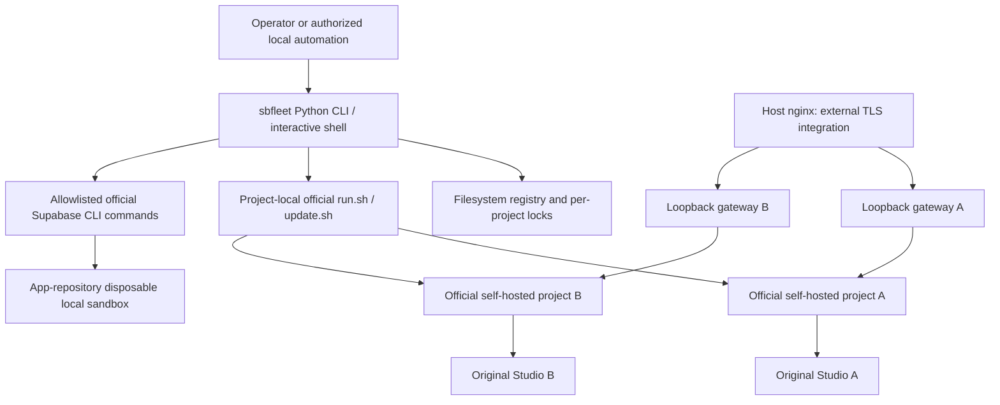

# Locked architecture

## Boundaries

Python 3.10+, argparse, cmd, optional readline, pathlib/json, subprocess, urllib, hashlib and fcntl. No framework. `tomllib` on 3.11+, conditional `tomli` dependency on 3.10 for safe sandbox TOML parsing is the sole planned runtime Python dependency. No YAML dependency: render a small deterministic override; use Compose's `config --format json` as the parser and semantic authority. pyproject/setuptools console entry point `sbfleet = sbfleet.cli:main`. Development uses pytest, ruff and build.

Support local Linux Docker Engine 28+ (loopback publishing protection), Compose >=2.24.4 with an actual `!override` capability probe, Git, POSIX shell/coreutils, OpenSSL, jq and Node >=16 for upstream key generation. Require local Node to avoid upstream's unpinned Docker Node fallback. Backup adds the host `age` tool; never implement encryption. Supabase CLI is optional except sandbox operations, pinned/tested initially at v2.118.0. Inspect version/help, refuse incompatible versions until the adapter is verified. No automatic dependency installation.

## Small ownership split

Upstream owns images, service wiring, SQL bootstrap, API gateway routes, Studio, Auth and key-generation algorithms. sbfleet owns paths, namespacing/ports, operation safety, backup orchestration, status probes and its generated files. Applications own schema migrations and runtime roles. Host operator owns Docker authorization, disk, SMTP, DNS, nginx and certificates.

Proposed modules are `cli`, `shell`, `registry`, `authority`, `process`, `upstream`, `compose`, `projects`, `health`, `backup`, `update`, `sandbox`, `nginx`. Keep closely related helpers in these modules; splitting for readability is allowed, creating an internal workflow engine is not. One synchronous process per invocation; advisory file locks serialize conflicts. No background agents or central registry service.

Mutating long-lived project operations (start/stop/restart/remove and backup/restore/update preparation) pass through `authority.authorize_mutation`: resolve → registry-then-project lock → re-read metadata → recompute identity → managed-path checks → effective Compose contract → live Docker ownership inventory → refuse unresolved journals → authorize. Compose selectors are forced from recomputed `fleet_id`+`project_id`; mutable `.env` selectors that disagree are refused. This is accidental/stale/tamper fail-closed protection, not a hostile same-user Docker/filesystem sandbox.

## Official deployment and profile

Initial pin: `self-hosted/v0.8.2`, commit `564eab8ad7840b13324f68b1bfac074ef8d51c21`. Materialize `docker/` from this exact official commit into each project's `deployment/`, never symlink to the sbfleet source or cache. Preserve vendor bytes. Write `.supabase-version` as `ref=self-hosted/v0.8.2`; record ref AND SHA in project metadata. Track resolved image IDs/digests on successful start. Ref/SHA mismatch fails closed.

Use `standard` only: studio, api-gw, auth, rest, realtime, storage, imgproxy, meta, functions, db, supavisor. Upstream's base no longer includes analytics/vector. Do not add its logs override: it mounts the Docker socket and routes by fixed names. `sbfleet logs` uses Docker logs instead. Core/storage/full pruning is deferred because gateway routes and Studio features reference the base services and no supported minimal profile was proven. This is an evidence-based selection of the official standard deployment, not a guessed trimmed stack.

## Compose contract

Read NETWORK_AND_PORTS for the exact overlay. Explicit identity overrides upstream `name: supabase`; every fixed container_name is replaced. Preserve Realtime's upstream DNS alias on the private project network. Ports are REPLACED with `!override`, never appended. Bind roots are project-local. Secret-generation Compose edits are confined to staging; translate the four upstream key-enabling environment entries to the fleet override. Effective config is checked before any mutation. The supported model rejects extra overrides, external networks/volumes, host networking, Docker socket mounts and arbitrary bind paths.

Normally call `sh run.sh start|stop|restart|pull` with a sanitized environment and cwd at the deployment. Use explicit scoped Compose commands for structured status, finite logs, backup service ordering and ownership-safe deletion where run.sh has no safe equivalent. Never call upstream reset.sh. Every command gets the exact COMPOSE_PROJECT_NAME, COMPOSE_FILE and COMPOSE_PATH_SEPARATOR; persist those in .env as well. Never forward arbitrary flags to upstream scripts.

## Architecture challenge, resolved before task generation

Compose identity alone fails on fixed containers and host ports. An override resolves both without a fork. Upstream scripts cover routine lifecycle; sbfleet must add ownership validation, transactional metadata and health assertions because scripts do not provide fleet safety. setup.sh unnecessarily installs dependencies, may use sudo, changes Compose and pulls before isolation: copy the verified snapshot and invoke its existing generators in staging instead. update.sh is reusable in a private staged configuration tree; its plaintext config backup and early version stamp require containment and later promotion. Cold PostgreSQL backups avoid inventing a cross-version logical restore engine, include all databases/roles and support the small operator's maintenance windows. These backups deliberately require downtime and exact-image restoration.

Only operation intent/failure and last verified version are persisted; health comes from Docker plus probes. No durable active-project state is needed. nginx installation remains an explicit operator workflow, not a privileged feature. These decisions remove infrastructure rather than recreate it.

## Hard boundaries and honest limits

Docker users and arbitrary code running as the same OS user can access fleet secrets/resources. Namespaces are operational isolation, not a hostile multi-tenant security boundary. The sandbox wrapper restricts its own commands, credentials and targets; it cannot stop an unrestricted agent from running other binaries or reading the user's home. For actual no-authority agents use a separate OS account/VM and Docker daemon without fleet data or Cloud credentials. Full local destructive authority applies only there or to expressly adopted disposable sandbox resources.

The backup, update, isolation, secret, Cloud and proxy models cannot change silently. Material contradictions become BLOCKED_ARCHITECTURE with evidence; continue independent safe work.
